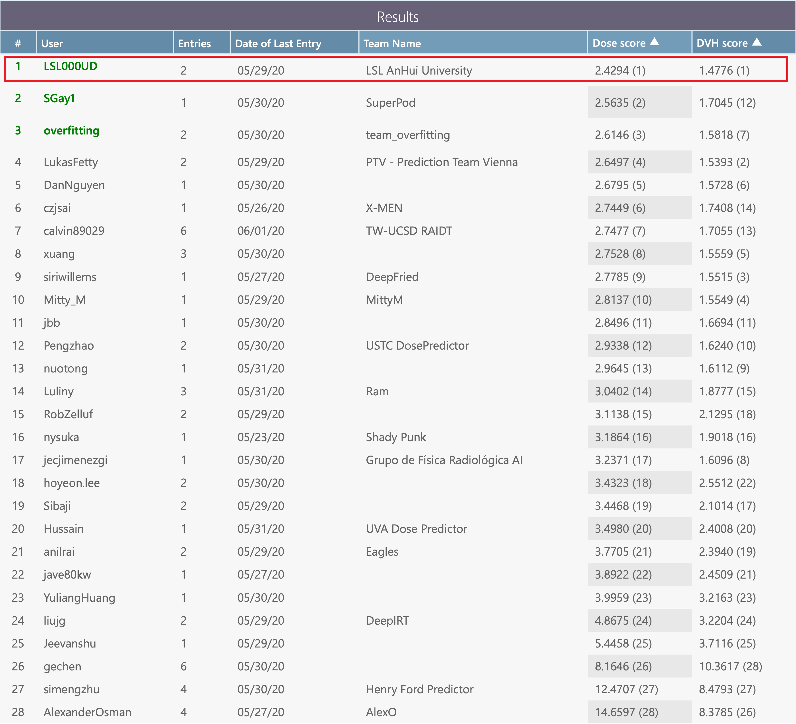

# RTDosePrediction
Automatic Radiotherapy Treatment Planning ， Knowledge-Based Planning ， Dose Prediction ， Cascade 3D Network (C3D) ，DCNN,  Head and Neck , 
1st Place Solution to the AAPM OpenKBP challenge  

Please feel free to concat me if you have any questions，
email: **1980073622@qq.com**, Shuolin Liu

## Warning， this repository will be closed !!!!!!!!!!!!!!!!!!!!!!!!!!!!!!!!!
Due to some conflicts of interest, this repository will be closed in two weeks. If you wish to continue using it, please copy the codes and save them to your own machine. The licence for these codes is still the MIT licence.

## Overview
This repository contains an PyTorch implementation for radiotherapy dose prediction, along with pre-trained models and examples.

The goal of this implementation is to be simple, highly extensible, and easy to integrate into your own projects. This implementation is a work in progress -- more dose prediction models are currently being implemented. Currently support：

- [C3D](https://aapm.onlinelibrary.wiley.com/doi/10.1002/mp.15034): a cascade 3D network for radiotherapy dose prediction, the 1st place solution to the AAPM OpenKBP challenge 

- [DCNN](https://doi.org/10.1088/1361-6560/aba87b): a lightweight dose prediction method

- [HD-Unet](https://iopscience.iop.org/article/10.1088/1361-6560/ab039b): a hierarchically densely connected U-net, Dan Nguyen et al. Compared to original HD-Unet paper, we add instance normalization (IN) for better performance. We reported the results of original HD-Unet in C3D paper

## Performance
- Results on [OpenKBP](https://aapm.onlinelibrary.wiley.com/doi/10.1002/mp.14845) **Test Set** using a **Single model** with test-time augmenation(TTA)

| Model | Batch size | GPU memory | Training iterations | Training time |   Dose score|  DVH score|Pre-trained Models|
|-----| :------------: | :----: | :----: | :----: |:----: |  :------------: |:----: |
| [C3D](https://aapm.onlinelibrary.wiley.com/doi/10.1002/mp.15034) (3D) | 2 | 18Gb | 80,000 | 50 hours (Two 1080TIs)|  **2.46** |**1.46** |  [Google Drive](https://drive.google.com/file/d/1YaXkOCfH-nrKD3nli5_Z6stF1rYWMA-v/view?usp=sharing)   [Baidu Drive, PassWord：voni](https://pan.baidu.com/s/1vwElN1xa8Zk1OlziPFsXgw)|
| [DCNN](https://doi.org/10.1088/1361-6560/aba87b) (2D) | 32 | **3Gb** | 100,000 | **20 hours (Single 1080TI)**|  2.75 |1.68 | [Google Drive](https://drive.google.com/file/d/1dWOYf7rmmyxco5pF75j8Qqt6U9ZmsmhK/view?usp=sharing)   [Baidu Drive, PassWord：j56y](https://pan.baidu.com/s/1EVG5wP_n04dcphAft1p6-w)|
[HD-Unet](https://iopscience.iop.org/article/10.1088/1361-6560/ab039b) (3D) | 2 | 16Gb | 80,000 | - hours (Single A100)|  2.59 |1.64 | [Google Drive](https://drive.google.com/file/d/1ooFvPu288yBZLYK6tBuI-RT4f2bMCdYo/view?usp=sharing)   [Baidu Drive, PassWord：cc61](https://pan.baidu.com/s/1yXOo2edxbSu4Or30Mpo5FA)|

- OpenKBP leaderboard

 

## Requirements
- torch >=1.2.0
- tqdm
- opencv-python
- numpy
- SimpleITK 
- pandas
- scikit-image
- scipy

## Usage
1. Data Preparation
	- Download [OpenKBP challenge repository](https://github.com/ababier/open-kbp), and copy the repository to   `/path_to_your_RTDosePrediction/RTDosePrediction/Data/`

		**For me,  `/path_to_your_RTDosePrediction/` is `E://Project/RTDosePrediction-main/`**
    - C3D：

      ~~~
      cd /path_to_your_RTDosePrediction/RTDosePrediction/Src/DataPrepare
      python prepare_OpenKBP_C3D.py
      ~~~
		
		The training Data will be saved in `/path_to_your_RTDosePrediction/RTDosePrediction/Data/OpenKBP_C3D`
   - DCNN：

      ~~~
      cd /path_to_your_RTDosePrediction/RTDosePrediction/Src/DataPrepare
      python prepare_OpenKBP_DCNN.py
      ~~~
      
      The training Data will be saved in `/path_to_your_RTDosePrediction/RTDosePrediction/Data/OpenKBP_DCNN`

2. Training
	- C3D：

      ~~~
      cd /path_to_your_RTDosePrediction/RTDosePrediction/Src/C3D
      python train.py --batch_size 2 --list_GPU_ids 1 0 --max_iter 80000
      ~~~
      
      **Larger batch_size will bring more stable results. If you want to train C3D with batch size of 4, use:**  
      
     	`python train.py --batch_size 4 --list_GPU_ids 3 2 1 0 --max_iter 80000`
	- DCNN：

      ~~~
      cd /path_to_your_RTDosePrediction/RTDosePrediction/Src/DCNN
      python train.py --batch_size 32 --list_GPU_ids 0 --max_iter 100000
      ~~~

3. Testing

	The prediction results will be saved in `/path_to_your_RTDosePrediction/RTDosePrediction/Output/XXX/Prediction`

	- C3D：

      ~~~
      cd /path_to_your_RTDosePrediction/RTDosePrediction/Src/C3D
      python test.py --GPU_id 0 
      ~~~
    
	- DCNN：
      ~~~
      cd /path_to_your_RTDosePrediction/RTDosePrediction/Src/DCNN
      python test.py --GPU_id 0 
      ~~~

4. Using pre-trained models

	- Download model weights for C3D ([Google Drive](https://drive.google.com/file/d/1YaXkOCfH-nrKD3nli5_Z6stF1rYWMA-v/view?usp=sharing), [Baidu Drive, PassWord：voni](https://pan.baidu.com/s/1vwElN1xa8Zk1OlziPFsXgw)) and DCNN([Google Drive](https://drive.google.com/file/d/1dWOYf7rmmyxco5pF75j8Qqt6U9ZmsmhK/view?usp=sharing), [Baidu Drive, PassWord：j56y](https://pan.baidu.com/s/1EVG5wP_n04dcphAft1p6-w))
	- Copy model weights to `/path_to_your_RTDosePrediction/RTDosePrediction/PretrainedModels`

	- C3D：
      ~~~
      cd /path_to_your_RTDosePrediction/RTDosePrediction/Src/C3D
      python test.py --GPU_id 0 --model_path ../../PretrainedModels/C3D_bs4_iter80000.pkl
      ~~~
	- DCNN：
      ~~~
      cd /path_to_your_RTDosePrediction/RTDosePrediction/Src/DCNN
      python test.py --GPU_id 0 --model_path ../../PretrainedModels/DCNN_bs32_iter100000.pkl
      ~~~

## Citation
if you find C3D and DCNN useful in your research, please consider citing:

- C3D
~~~
@article{C3D,
   title = {Technical Note: A Cascade 3D U-Net for Dose Prediction in Radiotherapy},
   author = {Shuolin Liu and Jingjing Zhang and Teng Li and Hui Yan  and Jianfei Liu},
   journal = {Medical Physics,  https://doi.org/10.1002/mp.15034}
}
~~~
- DCNN

~~~
@article{DCNN,
   title = {Predicting voxel-level dose distributions for esophageal radiotherapy using densely connected network with dilated convolutions},
	doi = {10.1088/1361-6560/aba87b},
	url = {https://doi.org/10.1088%2F1361-6560%2Faba87b},
	year = 2020,
	month = {oct}, 
	publisher = {{IOP} Publishing},
	volume = {65},
	number = {20},
	pages = {205013},
	author = {Jingjing Zhang and Shuolin Liu and Hui Yan and Teng Li and Ronghu Mao and Jianfei Liu},
	journal = {Physics in Medicine {\&} Biology
}
~~~
## Acknowledgement
Thank OpenKBP Organizers： Aaron Babier, Binghao Zhang, Rafid Mahmood, Timothy Chan， Andrea McNiven， Thomas Purdie， and Kevin Moore. 

- https://github.com/ababier/open-kbp

